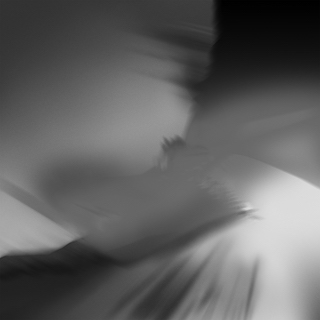
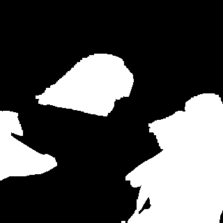
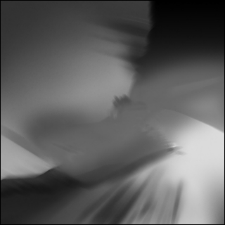

# Erosion/Dilation

>鄢新 515110910013

## Develop Environment

* **Language**: Python3
* Library: PIL, numpy
* System: macOS Mojave(10.14)
* CPU: 2.3 GHz Intel Core i7
* Memory: 8 GB 1600 MHz DDR3
* Graphic Card: NVIDIA GeForce GT 650M 1024 MB
Intel HD Graphics 4000 1536 MB

## Introduction

This assignment provided erosion and dilation modification to the grey scale picture. And set 4 kernels for binary modification and 4 masks for grey scale modification.

### Binary Kernel

    kernel1 = np.array([[0, 255, 0],
                        [255, 255, 255],
                        [0, 255, 0]])
    kernel2 = np.ones((3,3))*255
    kernel3 = np.array([[0, 0, 255, 0, 0],
                        [0, 255, 255, 255, 0],
                        [255, 255, 255, 255, 255],
                        [0, 255, 255, 255, 0],
                        [0, 0, 255, 0, 0]])
    kernel4 = np.ones((5,5))*255

### Grey Scale Mask

    #grey mask
    mask1 = np.array([[0,1,0],
                      [1,1,1],
                     [0,1,0]])
    mask2 = np.ones((3,3))
    mask3 = np.array([[0,0,1,0,0],
                    [0,1,1,1,0],
                    [1,1,1,1,1],
                    [0,1,1,1,0],
                    [0,0,1,0,0]])
    mask4 = np.ones((5,5))## Guide
Enter the dictionary in terminal and type the command`python3 morphological`, then enter the filename of the picture you want to modify and the modification type you want(A for the Binary and B for the grey scale). Then the modification will start automatically and the result will be preserved in the pics dictionary.

## Report

### Source Image

I used two source image to test the funcion

And the result are as belows

### Result

#### Picture 1 Binary Dilation

#### Picture 1 Binary Erosion

#### Picture 2 Binary Dilation

#### Picture 2 Binary Erosion

#### Picture 2 Grey Scale Dilation

#### Picture 2 Grey Scale Erosion

### Summary
The effect get more obvious while the kernel goes bigger. This program can only handle picture in grey mode but not in rgb mode or rgba mode, it can be improved by modify each tunnel separately.